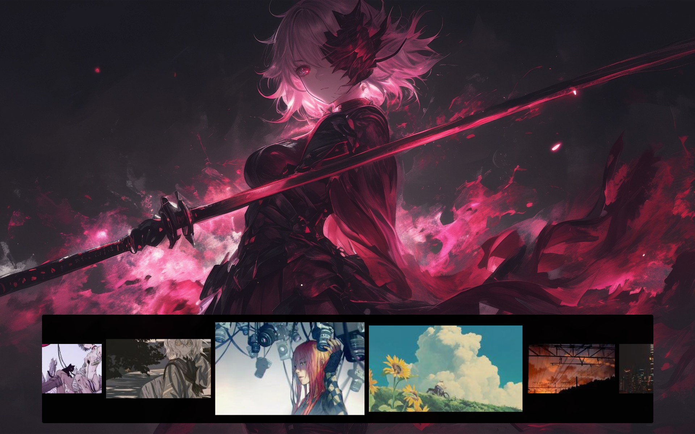

# 🖼️ Swifty

A lightweight and visually appealing **wallpaper selection menu** built for **Hyprland** (or other Wayland compositors).  
This tool allows you to **preview and apply wallpapers quickly** through a minimal popup interface.

> ⚙️ Built using **C++** and **Qt**, the original design and logic is from [RyuZinOh's dotfiles](https://github.com/RyuZinOh/.dotfiles).

---

## ✨ Features

- 🖼️ Scrollable wallpaper preview row  
- ⚡ Instant wallpaper apply  
- 🔧 Uses Swww as backend to set wallpaper   
- 🔧 Configurable bindings via Hyprland keybinds  
- 🧩 Lightweight and fast  

---

## 🧭 Preview




## ⚙️ Prerequisites

Make sure you have the following installed before building:

| Dependency | Description |
|-------------|-------------|
| **Qt5/Qt6** | Required for GUI development |
| **qmake** | Qt build tool (used to generate Makefiles) |
| **swww** | Wallpaper daemon for Wayland/Hyprland |
| **make / g++** | For building and linking |
| **pkg-config** | To detect dependencies |

### 🧩 On Arch-based systems:
```bash
sudo pacman -S qt5-base qt5-tools swww make gcc pkgconf
```
---

## ⚠️ Important Note

> **Swifty** expects all wallpapers to be stored in:  
> ```
> ~/Pictures/Wallpapers
> ```
> Make sure your wallpaper files are placed in that directory, or the selector will not detect them.  
> *(Make sure the dir name is also same as above otherwise it wont detect wallpapers also you can have multiple dirs inside the above dir and swifty will fetch walls recursively.)*
---
## 🔧 Installation

```bash
git clone https://github.com/<your-username>/swifty.git
cd swifty
./swifty
```
---
##🧩 Hyprland Keybind Setup
> Add this to your hyprland.conf
```bash
bind = $mainMod+Shift, S, exec, pkill -x swifty || <path/to/swifty-binary>
```
> Make sure you add `pkill -x swifty` otherwise the swifty will always run as background process.
> You will also need to set windowrules as per your prefrence.

---
##🙌 Credits
> Original work by [RyuZinOh](https://github.com/RyuZinOh)
